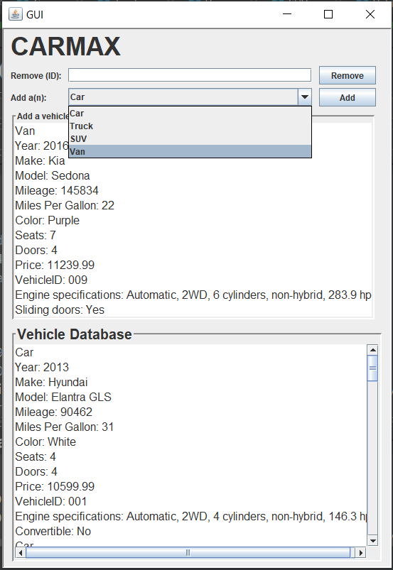

# Major-Program-2-Spring-2020
## COMP 167 Spring 2020
### Due: March 29th, 2020 11:59 PM
#### Submissions that are late are deducted 10 points each day they are late. After 3 days of being late the grade will be an automatic 0.

##  Introduction

You will be writting a program to interface with a database of vehicles for a used car lot. The database will be accessed via a GUI.

## Git and GitHub

You will submit this project using GitHub pull requests. You **must** create a GitHub pull request for each level to receive credit. You should request your assigned reviewer on your pull request. Review the following resource on git and GitHub for major programs _before_ you start work:

- [Written Explanation](https://gist.github.com/ccannon94/511115be821a873ae9ec5f4db9cfdda0)
- [YouTube Video](https://www.youtube.com/watch?v=l2bP9JKQkdA)

You **must** complete all work on a separate branch. You CAN NOT push code to the master branch. Review the above git and GitHub resources to learn about branching.

Remember to add your assigned TA as a reviewer. You can find your assigned reviewer from the previous Major Program.

## Class UML


## Classes/Methods

You are required to implement all of the classes and their associated methods listed  above. You will be required to use what you've learned about **inheritance** to implement this program correctly. You must include but are not limited to the methods listed in the UML, so feel free to create your own additional methods.

### Lot Class

This class contains a name and a list of vehicles that are of type String and ArrayList, respectively. The **loadVehicles()** method reads properties of vehicles from the "lot.txt" file and stores them in the ArrayList; and **saveVehicles()** method writes properties of the vehicles in the ArrayList to the "lot.txt" file.

### Vehicle Class

This is the class that the Car, Truck, SUV, and Van classes **inherit** from. The **vehicleID** is a 3-digit number and any two vehicles cannot have the same ID. The **toString()** method concatenates the properities of the class into a single string with each property specified and seperated by a new line.

### Car Class

Some cars can be convertibles. The **toString()** method concatenates the properities of the class into a single string with each property specified and seperated by a new line.

### Truck Class

Yrucks have beds. The **bedSpace** property represents the cubic footage of the truck's bed. The **toString()** method concatenates the properities of the class into a single string with each property specified and seperated by a new line.

### SUV Class

SUVs have cargo space and some have removable seats in the back. The **cargoSpace** property represents the cubic footage of the cargo area in the back of the SUV and the **removableSeats** property represents whether or not the back seats can be removed. The **toString()** method concatenates the properities of the class into a single string with each property specified and seperated by a new line.

### Van Class

Some vans have sliding doors. The **slidingDoors** property represents whether or not the van had sliding doors. The **toString()** method concatenates the properities of the class into a single string with each property specified and seperated by a new line.

### Engine Class

The **toString()** method concatenates the properities of the class into a single string with each property specified and seperated by a **comma**.

Example of the **toString()** method for a Car object:

```
Year: 2013
Make: Hyundai
Model: Elantra GLS
Mileage: 90462
Miles Per Gallon: 31
Color: White
Seats: 4
Doors: 4
Price: 10599.99
VehicleID: 001
Engine specifications: Automatic, 2WD, 4 cylinders, non-hybrid, 146.3 hp
Convertible: No
```
Note: The *Engine specifications* part is derived from the Engine class's toString() method.

## GUI

You will be implementing a GUI for this project. The GUI will display the details of the vehicles occupying the ArrayList. It will also allow the user to add or remove vehicles from the ArrayList. **Note:** Your GUI doesn't have to look exactly like mine as long as it showcases the same functionalities.

### GUI Example



The top portion of the GUI takes the info for the vehicle to be added and the bottom portion displays the current database. To add a vehicle the user must enter the vehicles data in the text area above using the **same format as the .txt file.** To remove a vehicle, the user must specify the ID of the vehicle to be removed.

## Grading

If your code doesn't compile, you get a zero.

### Level 1 (35 points)

Implement all classes instead of the Lot class.

### Level 2 (25 points)

Implement the **loadVehicles()** method in the Lot class. Remeber, this method should read from the text file, instantiate a vehicle object, and add it to the ArrayList accordingly.

### Level 3 (20 points)

Implement the **saveVehicles()** method in the Lot class. This method writes all current vehicle data to the "lot.txt" file using the java FileWriter class. **WARNING: Be careful writing to a text file! Data can be overwritten with no way of getting it back. Make a backup of the your "lot.txt" file and make use of the "lot.txt" in the repo.** The file should be written to in a way that your program can then read from it via loadVehicles(). 

### Level 4 (10 points)

Have the GUI display the display the current vehicles in the ArrayList.

### Level 5 (10 points)

Implement the add and remove buttons. 
